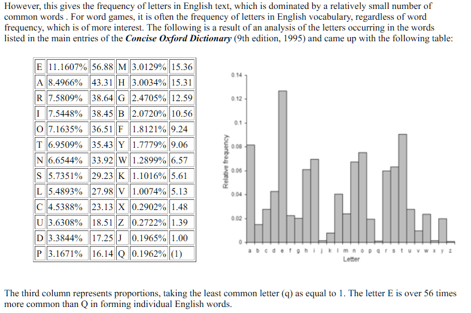
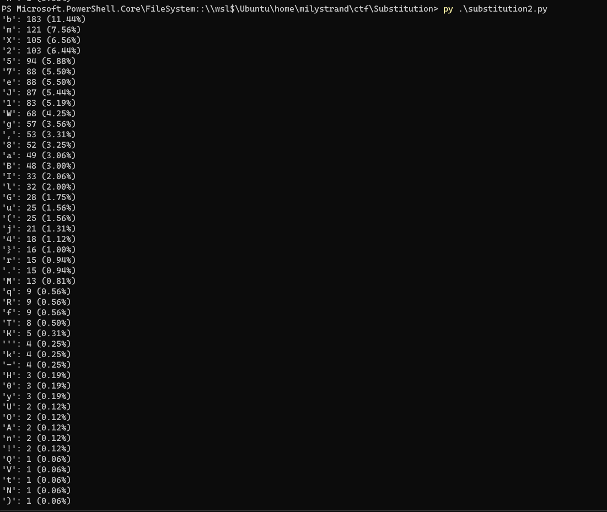
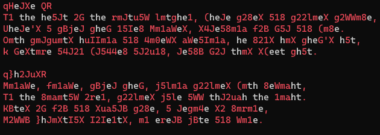
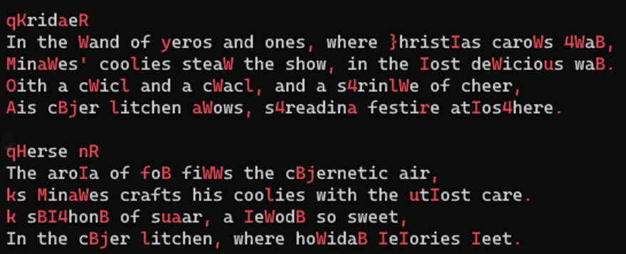

+++
title = 'Cyberkok Substitutten'
categories = ['Kom godt i gang']
date = 2023-12-01T10:04:58+01:00
+++

## Challenge Name:

Cyberkok Substitutten

## Category:

kom-godt-i-gang

## Challenge Description:

... Err... Cyberkokken har vist haft en substitutvikar på besøg, som har sendt os følgende besked. Kan du hjælpe?

[Translated]
We seem to have received a message from a substitute chef, who has sent us the following message. Can you help?

_Hint: The text is in English_

```text
qHbJXb QR

T1 7eb eb5J7 2G 7eb rmJ7u5W lm7geb1, (ebJb g28bX 518 g22lmbX g2WWm8b,

UebJb'X 5 gBjbJ gebG 15Ib8 Mm1aWbX, X4Jb58m1a f2B G5J 518 (m8b.

Om7e gmJgum7X euIIm1a 518 4m0bWX aWb5Im1a, eb 821X emX gebG'X e57,

k GbX7mrb 54J21 (J544b8 5J2u18, Jb58B G2J 7emX X(bb7 ge57.


q}e2JuXR

Mm1aWb, fm1aWb, gBjbJ gebG, j5lm1a g22lmbX (m7e 8bWmae7,

T1 7eb 8mam75W 2rb1, g22lmbX j5lb 5WW 7eJ2uae 7eb 1mae7.

KB7bX 2G f2B 518 Xua5JB g28b, 5 Jbgm4b X2 8mrm1b,

M2WWB }eJmX7I5X I2Ib17X, m1 brbJB jB7b 518 Wm1b.

continues on with similar text.....
```

## Approach

As indicated, the text is in English. We first observe that the text is structured with line breaks and typically ends with commas or periods. The first line in each section is noticeably shorter than the rest, and almost all lines end with the same two letters in an AA BB structure, typical of many rhymes.

Structured data like this is commonly seen in Caesar ciphers. Yet running it though a Caesar cipher decoder doesn't yield anything meaningful, suggesting a more complex cipher.

To gain insights, we try to employ a frequency analysis. A quick search reveals the most common letters in the English Dictionary. Given the cipher text's length, this should provide useful insights.



Using a Python script, we analyze the letter frequency of the ciphered text:

```python
from collections import Counter

def read_message_from_file(file_path):
    with open(file_path, 'r') as file:
        return file.read()

file_path = 'besked.txt'
message = read_message_from_file(file_path)
message_no_spaces_newlines = message.replace(' ', '').replace('\n', '')
char_frequency = Counter(message_no_spaces_newlines)

total_chars = sum(char_frequency.values())

sorted_char_frequency = dict(sorted(char_frequency.items(), key=lambda item: item[1], reverse=True))

for char, count in sorted_char_frequency.items():
    percentage = (count / total_chars) * 100
    print(f"'{char}': {count} ({percentage:.2f}%)")
```



Starting with shorter words helps in deciphering the text. For example, deciphering "7eb" as "the" is an initial step. To simplify this process, we use a helper program for character substitution:

```python
def replace_characters(message):
    char_map = {
    'b': 'e',
    '7': 't',
    'e': 'h'
    }

    # ANSI escape code for red color and reset
    RED = '\033[91m'
    RESET = '\033[0m'

    modified_message = []

    for char in message:
        if char in char_map:
            modified_message.append(char_map[char])
        else:
            modified_message.append(f"{RED}{char}{RESET}")

    return ''.join(modified_message)

file_path = 'besked.txt'

message = read_message_from_file(file_path)
modified_message = replace_characters(message)

print(modified_message)
```



The output of this script aids in gradually mapping out more characters:



Lastly getting the flag:


## Flag

```text
nc3{merry-merry-cookie-christmas}
```
