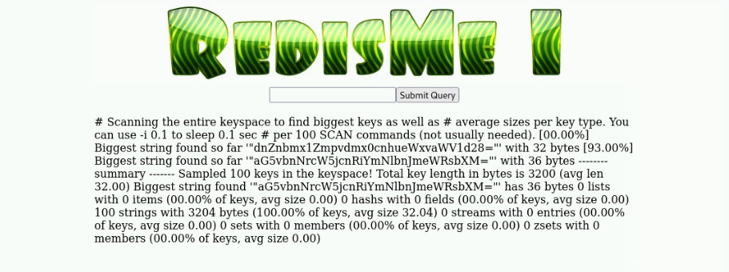

+++
title = 'RedisMe 1'
categories = ['Web']
date = 2023-12-10T22:00:18+01:00
scrollToTop = true
+++

## Challenge Name:

RedisMe 1

## Category:

Web

## Challenge Description:

Ingen af nisserne ved, hvor flaget er, og nissedev har selvfølgelig g(l)emt det...

_Opgaven er tilgængelig via Haaukins:_

https://ncctf.haaukins.dk

## Approach

This challenge is a bit more like the "classical" HackTheBox challenges, in which you first need to scan the target in order to discover open ports!
So on our Kali box we do a

```bash
┌──(haaukins㉿kali)-[~]
└─$ nmap --open 77.52.35.0/24
Nmap scan report for 77.52.35.5
Host is up (0.0010s latency).
Not shown: 998 filtered tcp ports (no-response)
Some closed ports may be reported as filtered due to --defeat-rst-ratelimit
PORT   STATE SERVICE
22/tcp open  ssh
80/tcp open  http

Nmap done: 256 IP addresses (4 hosts up) scanned in 9.00 seconds
```

We take note of port 22 (ssh) & 80 (http, usually a web app) being open!
This would ordinarily indicate that we need to exploit a webapp (often PHP-based) being hosted on an Apache server!

We visit the webapp in our browser and find the following page


I quickly download the image on the webapp and check it with the Stego tool [Aperisolve](https://www.aperisolve.com/) for any clues, but didn't find anything...

I then test out some commands in the input field and discover that it is contacting a Redis database on the server, via the redis-cli!
I quickly run the standard INFO command for some enumeration of the database


I immediately search for Redis exploits on version 6.0.7, especially exploits related to SSH, seeing as port 22 is open!
Despite trying out the following [RCE attack](https://book.hacktricks.xyz/network-services-pentesting/6379-pentesting-redis#interactive-shell) in different variations, I accept that it is not the right path, based on the nice feedback provided by the team behind the challenge (You cannot do this, translated from Danish)!


I then start enumerating the database for information with the following command, which reveals 100 keys in the DB!

```bash
KEYS *
```


Whenever I try to use the GET command to get the value of any of the keys it seems to always be the same name as the key itself, but sometimes it even seemed as though the key itself disappeared!... This could indicate that there is a cronjob running on the server, which randomizes the keys inserted into the DB!...

All the names looks to be in some base-encoded value, but despite running several through Cyberchef, none of them provided anything meaningful...

I then turned to reading A LOT of Redis documentation, in order to understand the possible commands for enumeration/exploitation purposes and came across the command

```bash
--bigkeys
```

Which reveals largest keys in the DB!


When executing a GET command for the largest key found so far it finally retrieved a different value than the key name!


```bash
echo "TkMze3lheV9kdV9lcl9lbl9yZWRpcy1wcm99" | base64 -d
```

This is a base64 encoded string, which decodes to the...

## Flag

```text
NC3{yay_du_er_en_redis-pro}
```

## Reflections and Learnings

### Importance of Enumeration:

This challenge reinforces the importance of thorough enumeration in cybersecurity. The initial nmap scan was crucial in identifying open ports and potential attack vectors. Understanding the services behind these ports can significantly narrow down the focus of the attack.

### Understanding the Target System:

Discovering that the input field communicated with a Redis database was a pivotal moment. It underlines the importance of understanding the target system's architecture and functionality. Identifying that the system used Redis opened up new avenues for exploration and exploitation.

### Persistence and Adaptability:

The challenge required a high degree of persistence and adaptability. When initial attempts to exploit known Redis vulnerabilities didn’t work, it was essential to adapt the strategy. This kind of flexibility is critical in cybersecurity, where not every attack vector will yield results, and thinking outside the box is often required.

### Effective Use of Feedback:

The feedback from the challenge team (“You cannot do this”) was a valuable clue. It emphasized the importance of paying attention to all available information, including error messages or any form of feedback from the system. These can provide hints about what paths to pursue or avoid.

### Deep Dive into Documentation!

One of the key strategies that paid off was delving into Redis documentation. This not only expanded understanding of the Redis system but also led to discovering the --bigkeys command. Comprehensive knowledge of the tools and technologies in play is crucial for effective problem-solving in cybersecurity.
