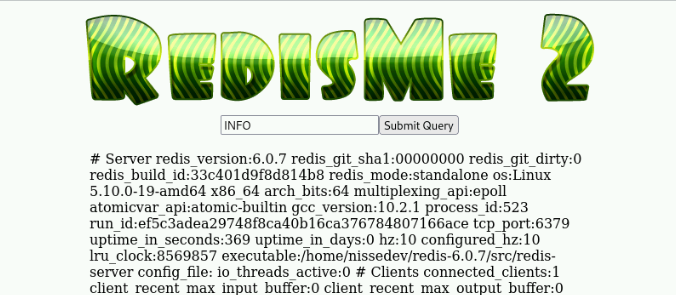

+++
title = 'RedisMe 2'
categories = ['Web']
date = 2023-12-10T23:00:18+01:00
scrollToTop = true
+++

## Challenge Name:

RedisMe 2

## Category:

Web

## Challenge Description:

Nissedev ved, at alle elsker Redis og bare vil have mere, så her er endnu en version af den geniale service.

Flaget ligger i `/flag.txt`

_Opgaven er tilgængelig via Haaukins:_

https://ncctf.haaukins.dk

## Approach

Armed to the teeth with all the experience from enumerating [RedisMe 1](/nc3/web/redisme-1), I quickly scan for the location of the database

```bash
┌──(haaukins㉿kali)-[~]
└─$ nmap --open 77.57.210.0/24
Nmap scan report for 77.57.210.5
Host is up (0.0013s latency).
Not shown: 999 filtered tcp ports (no-response)
Some closed ports may be reported as filtered due to --defeat-rst-ratelimit
PORT   STATE SERVICE
80/tcp open  http

Nmap done: 256 IP addresses (4 hosts up) scanned in 6.97 seconds

```

We take note of port 80 being the only open port this time!
At least that might ensure that it is "only" about the webapp and not lead us down the SSH exploitation path, like in the first challenge!

We visit the webapp in our browser and find the following page


Like the first challenge, I quickly download the image on the webapp and check it with the Stego tool [Aperisolve](https://www.aperisolve.com/) for any clues, but yet again I didn't find anything...

Well-prepared with an arsenal of Redis enumeration commands from the first challenge, I check the database for information.



The Redis version is the same and all settings appear to be identical to the last challenge.
That is however also where the similarities end, since the DB doesn't hold any keys and keyspaces are completely empty!


Seeing as the description states that we are now specifically looking for the flag, which is located at /flag.txt, I now switch strategy as this could potentially be retrieved using command injection!

This could be done in [Burpsuite](https://portswigger.net/burp), by adding a proxy, which intercepts a request to the database, upon which I could alter the request to print out the flag at the known location...
It is however much more simple to test the command injection directly in the input field!


And this did the trick!

## Flag

```text
NC3{thats_some_wild_redises}
```

## Reflections and Learnings

This was one of the challenges that really "annoyed me", because in the end it had little to do with the Redis database itself, but was a question of testing the "obvious" web attack vectors!
An absolutely great "checklist" to follow for web exploitation is the following by [OSCP Playbook](https://fareedfauzi.gitbook.io/oscp-playbook/services-enumeration/http-s/enumeration-checklist)

### Leveraging Prior Experience:

Having previously tackled "RedisMe 1", the familiarity with Redis and its enumeration techniques proved invaluable. This experience allowed for a quicker understanding of the challenge's environment, highlighting the importance of building upon past experiences in cybersecurity.

### Focused Approach:

Unlike the first challenge, "RedisMe 2" had a clear objective - to find the flag in /flag.txt. This specific goal helped in narrowing down the approach and avoiding unnecessary diversions. It emphasizes the need to understand the challenge's objectives clearly to direct efforts effectively.

### Rediscovering Redis:

The Redis database, though similar in setup to the first challenge, presented a different scenario with empty keyspaces. This variation required a shift in strategy, illustrating how similar environments can yield different challenges.

### Command Injection Success:

Discovering that command injection worked directly through the web application’s input field was a key breakthrough. It underscores the importance of trying various attack vectors, even those that might seem too straightforward or simple.

### Simplicity in Solution:

Sometimes, the simplest solution is the correct one. The direct use of command injection without over-complicating the process with tools like Burpsuite is a testament to this. It serves as a reminder that not all cybersecurity challenges require complex solutions; sometimes, direct approaches are best.
